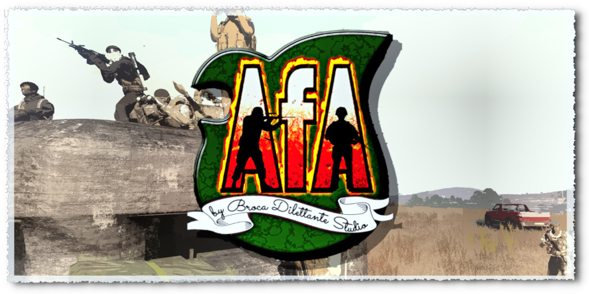

- **[Additions for Antistasi by Broca Dilettante Studio Models [BDSM]](#additions-for-antistasi-by-broca-dilettante-studio-models--bdsm-)**
>  * **[Info for Antistasi Dev's or other Mission Dev's](#info-for-antistasi-dev-s-or-other-mission-dev-s)**
>  * **[Infos](#Infos)**
>  * **[Contributing to the mod](#contributing-to-the-mod)**
>  * **[A word on the quality and style](#a-word-on-the-quality-and-style)**
>  * **[External Resources](#external-resources)**
>  * **[Authors](#authors)**
>  * **[License](#license)**

<small><i><a href='http://ecotrust-canada.github.io/markdown-toc/'>Table of contents generated with markdown-toc</a></i></small>

---
# Additions for Antistasi by Broca Dilettante Studio Models [BDSM]

## **[Prerelease]** Arma 3 Mod

Adding items and factions to make Antistasi more immersive, less reliant on DLC and generally stuff to overcome limitations of Vanilla in Antistasi. Currently, not implemented directly by the Antistasi Devs, but I hope it will be. If you like the additions in general please let me know!

> ## Info for Antistasi Dev's or other Mission Dev's
>
>
> If you like and want to use some parts or a single part of this mod (even single models) and not others, feel free to contact me via:
>
> - Github email
>
> - on Discord (available through Antistasi Discord , name **Giddi#5858**)
>
> - ***[best way is to just open an Issue here!](https://github.com/Giddius/Additions_for_Antistasi/issues/new)***
>
> I am completly open to making extra mods with only those parts for you.
> When there are some interdependencies please just give me time to figure out how to solve them.

***
---
## Infos

### Submods

#### Public Security
(Folder name: **"pubsec"** )
 > * 3 Police Factions (Altis Constabulary Guard, Tanoa Garde champêtre, Registered Cossacks of Chernarus)
 > * Police Belt, Police Hat and Police Helmet as new models. With texture variants for the 3 factions.
 > * Re textured Uniforms for the 3 factions each 1 standard and 1 special forces unit uniform
 > * re textured car and Little Bird for the 3 factions
 > * Police station building in a large and small variant

#### HQ extras
(Folder name: **"hqextras"** )
 > * A new Bunker for the rebels to build, that is designed to not have the problems the current bunker causes
 > * A new Anti-Air static in the early stages of development

#### Misc
(Folder name: **"misc"** )
 > * Undercover Long Range Radio Backpack, with an extra variant with the radio part removed

### Status

Work in Progress, first Wave release almost done

### Dependencies

currently, needs RHS for the first Wave (only because of the predefined Unit equipment and Groups), but will become optional in the future.

***
---
## Contributing to the mod

> **Note:** General Github help is always needed as this is also a new world for me.

### Especially needed

>* **(Everyone) If you think you can contribute or even if you want to collaborate to learn you are welcome!**
>* (Textures) Someone to create good textures
>* (Scripting) Someone capable of generating SQF scripts for some items
>* (Animation) Someone capable of fighting through the mess that is animation in Arma
>* (Artistic) Someone capable of producing some artistic assets like Insignia and markers and other things
>* (General) Meta scripting in other languages is always appreciated as I am still at the beginning of my learning curve (see "A word on the quality and style")

### Format guides

**[Please see this page for everything regarding the structure and format you should be using](Info/Format_Guide/README.md)**

### :vertical_traffic_light: What this mod should be and what not

#### :heavy_check_mark: What it should be

>* Everything should either fix a problem that has its root in the current assets used
>* Or expand the experience with interesting and emerging story generating assets.
>* It should still always feel like ANTISTASI and not something completely new or foreign to it
>* keeping every asset setting independent (ww2, modern, near future, different maps) would be perfect, but if it isn't possible, try to make variants.
>* try to stay within those settings (a "insert_setting_form_media" asset, could quickly make this mod bloated and the advantage for each setting on its own minimal).

#### :black_square_button: What should be limited

>* re textures as a whole
>* stuff that is already in RHS or 3cb, only in extreme exceptions and if there is a clear advantage of using this asset and not 3cbs

#### :warning: Hard NO's

>* This should not become a compendium for completely random stuff. Try to keep the "what it should be" guidelines in mind.
>* This shouldn't become a re texture mod as some many other are, if you need a few re textures for your sub mod that is ok, but if the sub mod is only re texture that's not.
>* No weird external Addon Dependencies and actually try to remove any non-vanilla dependencies int he future
>* **NO and Absolutely NO taking content (models, textures, whatever) from other Mods. Same thing regarding everything else, get something that is free, attribute the author, everything else is not wanted here.**
>* If you take a script from somewhere look at its license first and ask for permission.
>* No new game mod or variant of antistasi as a whole

#### :construction: Maybe's and ideas for the future

* small utility programs to help speed up some task for antistasi development (pvp load out creator, template creator)
* Database for Items (Vanilla, RHS, maybe 3cb) to make integration and modification easier.
* Map design
* Antistasi in game missions (the ones that can be spawned, not the mission as a whole)
* 3den Compositions
* config fix patches for RHS or 3cb

### General Todo

> **Note:** *Sub mod specific Todo's are in each sub mod folder.*

- [ ] create HQ extras sub mod folders
- [ ] write how_to readme
- [ ] create diagrams for structure
- [ ] create visual guides for readme
- [ ] create batch(?) file to automatically enter the "files called" in the header comments

***
---

## A word on the quality and style

I never learned to program or modeling, my education is purely in medicine and everyone knows how tech literate Doctors, Nurses and other medical personnel are :wink:.
The modeling I learned some time ago, but for 3d printing, so watertight static models with no textures. The rest I tried learning over the last 6 months.
The hardest was everything to do with coding, like the con figs. I personally also have to structure things weirdly to not lose the big picture.

What I want to say with all that is, I know that my models, my con figs, my textures are most likely not as efficient as they could be, but I am happy and open for input regarding that.
Every form of constructive criticism and advice is more than appreciated!

The folder structure and documentation may seem unnecessary  complex, but has a reason at least for me. If you want to contribute but feel like it is too much unnecessary  work, then
the worst thing that could happen is me asking you if I can do that for you. I will not force anyone to adhere to my weird system but   having a fixed system is important.
I am working toward automating most of it.

To explain the names: they can be overly long, but are also easily generated from macros and batch renaming becomes easy. I frustrated when I started because I misspelled the names and always had to look them up.

The folder structure is also grown out of the macro use.
I know macros are seen as bad coding, but for me they are preventing some stupid mistakes and helping me to not waste productiveness typing.

***
---

## External Resources

### Link to Blender files and unbinarized p3d

**[Dropbox Link to the files, because they are to large for Github](https://www.dropbox.com/sh/aw8a5y7cvpguoxo/AACRZtDWg0pDCUJZYzMeObc7a?dl=0)**

### General Links
- ~[Antistasi Github]()~
- ~[Antistasi Discord]()~

***
---

## Authors

Giddy

## License

TODO

